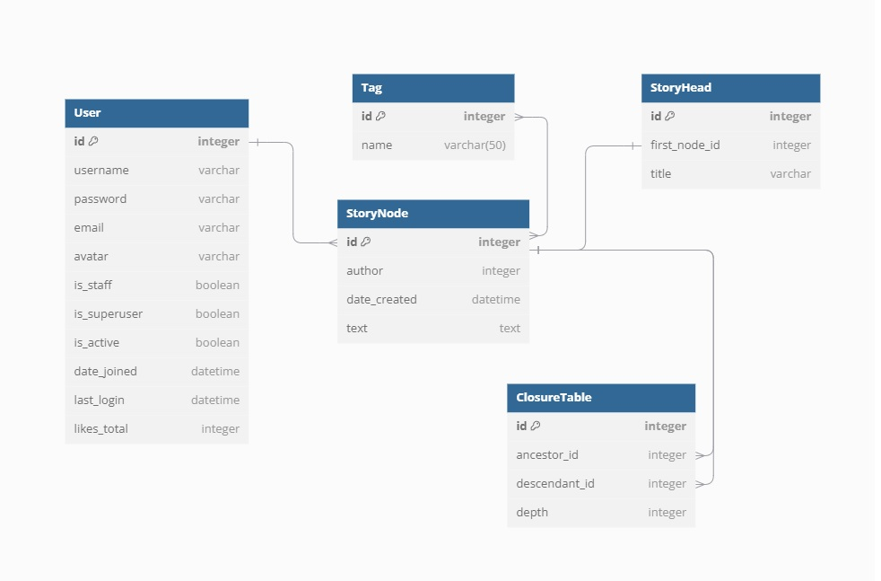

# NodeStory

This app is an online web-site for communal storywriting.

The main idea is to build an app where each story can from each place be 
continued by community writers, thus creating variable developments for the 
main plot. Each part of the story (e.i. "node") is graded by users, providing 
an opportunity for the best narration to pop up on the top of each story. 

### Default fixture users
* admin, password: "admin" - superuser
* farnaK, password: "Hemaphoho54" - casual user
* farmak, password: "Giggily15!" - casual user

### Database documentation

Sotries are stored in database as trees, the structure used for storage - ClosureTable.

Practically there are two tables:
* StoryNode, which keeps the "nodes", or parts of the story
* ClosureTable, which is used for storage of relations between nodes.

Recordings to ClosureTable are added automatically via calling "create" method of NodeStory Manager

This structure allows efficient access to all the descendants of 
particular node, as well as to all parents/any child, which is crucial for efficient
Depth-first search (DRF) of the tree.